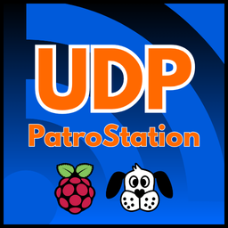

# BitDog Patro Station



A sleek and functional control panel made with [Godot 4](https://godotengine.org/) to interface with BitDogLab boards over Wi-Fi.  
Created with 💙 by Patro (Luis F. Patrocinio).

## 📸 Preview


## ✨ Features

- Real-time connection status and IP display
- RGB LED control (Red, Green, Blue)
- Custom message input and send
- Reset functionality
- Clean and responsive UI

## 🚀 Getting Started

1. Clone the repository:
   ```bash
   git clone https://github.com/luisfpatrocinio/bitdog-patro-station.git
   ```
2. Open the project with Godot 4.x.

3. Make sure your BitDogLab board is connected to the same Wi-Fi network.

4. Run the project and start interacting!

## 🔧 Tech Stack

- Godot Engine 4
- GDScript
- BitDogLab Wi-Fi board

## 🙌 Credits

Created by Luis Felipe Patrocinio

## 📄 License

This project is licensed under the MIT License.  
Feel free to use it in your projects -- just make sure to credit **Luis Felipe Patrocinio** ([GitHub](https://github.com/luisfpatrocinio)).  
See the [LICENSE](./LICENSE) file for full details.