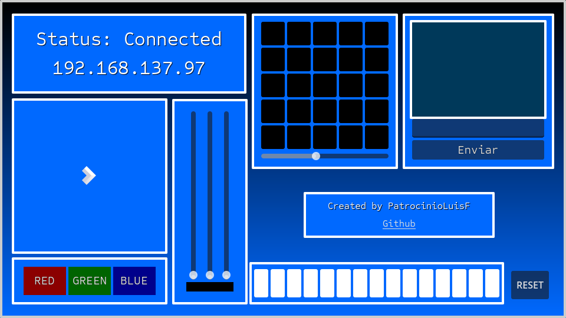

# BitDog Patro Station

A sleek and functional control panel made with [Godot 4](https://godotengine.org/) to interface with BitDogLab boards over Wi-Fi.  
Created with 💙 by Patro (Luis F. Patrocinio).

## 📸 Preview



## ✨ Features

- Real-time connection status and IP display
- RGB LED control (Red, Green, Blue)
- Custom message input and send
- Reset functionality
- Clean and responsive UI

## 🚀 Getting Started

1. Clone the repository:
   ```bash
   git clone https://github.com/luisfpatrocinio/bitdog-patro-station.git
   ```
2. Open the project with Godot 4.x.

3. Make sure your BitDogLab board is connected to the same Wi-Fi network.

4. Run the project and start interacting!

## 🔧 Tech Stack

- Godot Engine 4
- GDScript
- BitDogLab Wi-Fi board

## 🙌 Credits

Created by Luis Felipe Patrocinio

## 📄 License

This project is licensed under the **Creative Commons Attribution 4.0 International (CC BY 4.0)**.  
You are free to use, share, and adapt this project, as long as proper credit is given to the original author, Luis Felipe Patrocinio.

For more details, see the [license description](https://creativecommons.org/licenses/by/4.0/).
